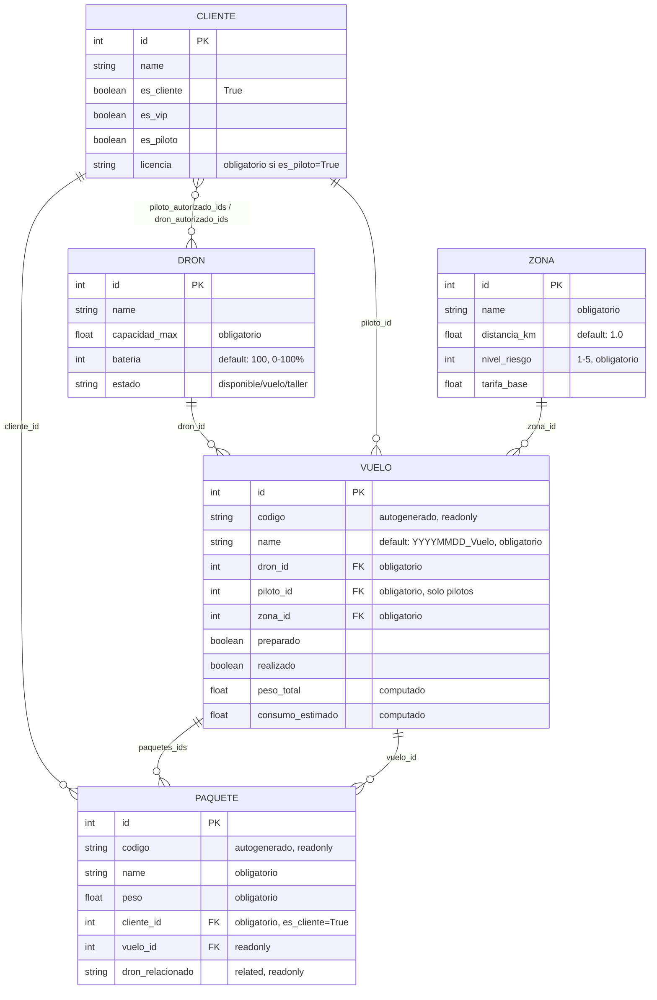

# Modelo de Datos - Dronify

## Diagrama ER

## Viernes 08/05 - Clase

+ Modificado el manifest para incluir información relevante, y application=True
+ Añadidos los modelos básicos + relaciones entre tablas. Faltarían comprobaciones y campos calculados.

### Viernes 08/05 - Casa

+ Modelos listos, con relaciones y constrains implementadas.

## Sábado 09/05

+ Vistas básicas (Cliente, piloto, zona) + Campos calculados y métodos para hacer comprobaciones (números válidos en pesos, km, etc)

## Domingo 10/05

+ Vistas básicas al 60%. Dron, Vuelos (sólo la lista, action y botón en menú)
+ Compila y se puede visualizar.

+ Faltan: actions para los botones del header de Vuelo, crear formulario para Vuelo

+ Faltan: perfeccionar las vistas para que muestren datos o los oculten según las condiciones.

## Martes 12/05

+ Dominios actualizados
+ Creación de códigos + nombre compute hechos
+ Datos de prueba creados (IA)